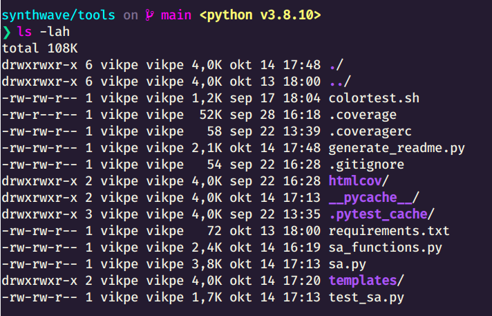

> Synthwave inspired color palette

## Palette

### Base


&nbsp; | HEX
--- | ---
 | `f9f972`
 | `ff00f6`
 | `aa54f9`
 | `55a8fb`
 | `00fbfd`
 | `241b30`


### Terminal / 16-color


&nbsp; | HEX | &nbsp; | HEX
--- | --- | --- | ---
 | `241b30` |  | `7f7094`
 | `9a0048` |  | `e60a70`
 | `00986c` |  | `0ae4a4`
 | `adad3e` |  | `f9f972`
 | `6e29ad` |  | `aa54f9`
 | `b300ad` |  | `ff00f6`
 | `00b0b1` |  | `00fbfd`
 | `b9b1bc` |  | `f2f2e3`


### Extended


&nbsp; | HEX | &nbsp; | HEX | &nbsp; | HEX | &nbsp; | HEX
--- | --- | --- | --- | --- | --- | --- | ---
 | `f9f972` |  | `adad3e` |  | `696437` |  | `474034`
 | `e60a70` |  | `9a0048` |  | `5f0e3c` |  | `421536`
 | `ff00f6` |  | `b300ad` |  | `6c0e6f` |  | `481550`
 | `aa54f9` |  | `6e29ad` |  | `49226f` |  | `371f50`
 | `55a8fb` |  | `2a6daf` |  | `274470` |  | `263050`
 | `00fbfd` |  | `00b0b1` |  | `126671` |  | `1b4151`
 | `0ae4a4` |  | `00986c` |  | `125a4e` |  | `1b3b3f`
 | `f9f9f1` |  | `f2f2e3` |  | `b9b1bc` |  | `7f7094`
 | `3a3245` |  | `241b30` |  | `1a1322` |  | `0f0b14`


## Sample implementations

### Terminal


### Fish

```sh
# https://fishshell.com/docs/current/cmds/set_color.html#cmd-set-color

set -U fish_color_normal b9b1bc # default color
set -U fish_color_command ff00f6 # commands like echo
set -U fish_color_keyword ff00f6 # keywords like if - this falls back on the command color if unset
set -U fish_color_quote 00fbfd # quoted text like "abc"
set -U fish_color_redirection f9f972 # IO redirections like >/dev/null
set -U fish_color_end f9f972 # process separators like ';' and '&'
set -U fish_color_error b9b1bc # syntax errors
set -U fish_color_param f2f2e3 # ordinary command parameters
set -U fish_color_comment 7f7094 # comments like '# important'
set -U fish_color_selection normal # selected text in vi visual mode
set -U fish_color_operator f9f972 # parameter expansion operators like '*' and '~'
set -U fish_color_escape 00b0b1 # character escapes like 'n' and 'x70'
set -U fish_color_autosuggestion 7f7094 # autosuggestions (the proposed rest of a command)
set -U fish_color_cwd normal # the current working directory in the default prompt
set -U fish_color_user normal # the username in the default prompt
set -U fish_color_host normal # the hostname in the default prompt
set -U fish_color_host_remote normal # the hostname in the default prompt for remote sessions (like ssh)
set -U fish_color_cancel normal # the '^C' indicator on a canceled command
set -U fish_color_search_match normal # history search matches and selected pager items (background only)
set -U fish_pager_color_progress normal # the progress bar at the bottom left corner
set -U fish_pager_color_background --background=normal # the background color of a line
set -U fish_pager_color_prefix b9b1bc --underline # the prefix string, i.e. the string that is to be completed
set -U fish_pager_color_completion 7f7094 # the completion itself, i.e. the proposed rest of the string
set -U fish_pager_color_description 7f7094 # the completion description
set -U fish_pager_color_selected_background --background=normal # background of the selected completion
set -U fish_pager_color_selected_prefix 0ae4a4 --bold --underline # prefix of the selected completion
set -U fish_pager_color_selected_completion 0ae4a4 # suffix of the selected completion
set -U fish_pager_color_selected_description f2f2e3 # description of the selected completion
set -U fish_pager_color_secondary_background normal # background of every second unselected completion
set -U fish_pager_color_secondary_prefix b9b1bc --underline # prefix of every second unselected completion
set -U fish_pager_color_secondary_completion 7f7094 # suffix of every second unselected completion
set -U fish_pager_color_secondary_description 7f7094 # description of every second unselected completion

```

### Fish + Starship


```toml
[character]
success_symbol = "[❯](bold 0ae4a4)"
error_symbol = "[❯](bold e60a70)"

[cmd_duration]
format = "[took $duration](#7f7094) "

[directory]
read_only = " "
style = "#00fbfd bold"

[git_branch]
format = "[on](#7f7094) [ $branch](#ff00f6) "

[package]
style = ""
format = "[is](#7f7094) [$version](#f2f2e3) "

[nodejs]
format = "[<node $version>](#f9f972) "

```

### FZF

```sh
# https://github.com/junegunn/fzf/wiki/Color-schemes

export FZF_DEFAULT_OPTS='
--color=fg:#7f7094,bg:-1,hl:#b9b1bc
--color=fg+:#00986c,bg+:#241b30,hl+:#0ae4a4
--color=info:#aa54f9,prompt:#0ae4a4,pointer:#241b30
--color=marker:#ff00f6,spinner:#aa54f9,header:#f9f972
'

```

<!--
## VCS / Diff

Status | C | Hex
--- | --- | ---
Added gutter |  | #125a4e
Added background |  | #1b3b3f
Deleted gutter |  | #5f0e3c
Deleted background |  | #421536
Modified gutter |  | #274470
Modified background |  | #263050
Conflict gutter |  | #696437
Conflict background |  | #474034
--!>

