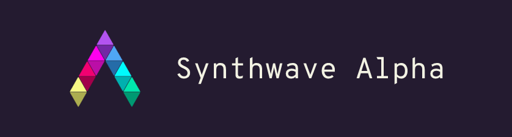
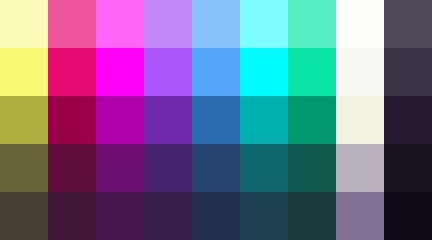
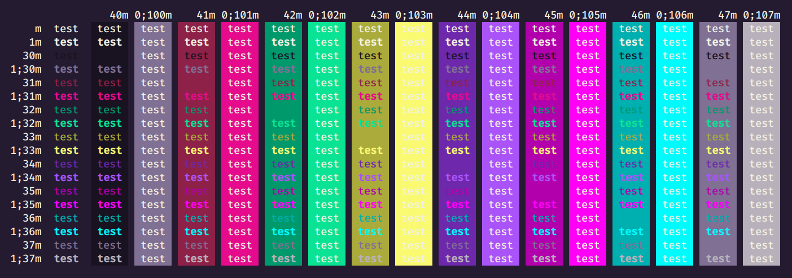
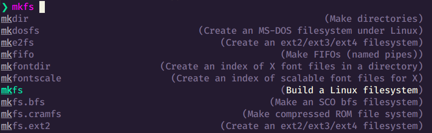
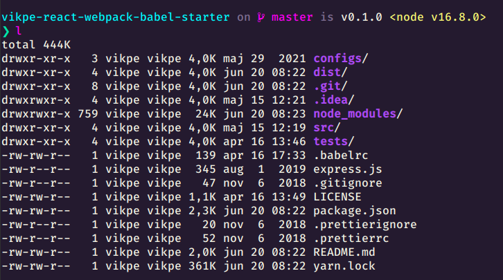
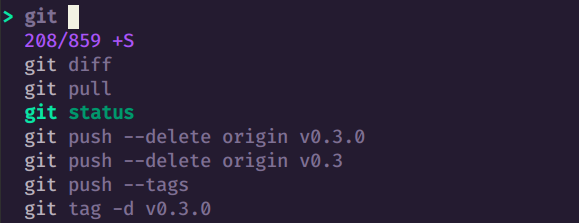

> Synthwave inspired color palette

## Palette

### Base


&nbsp; | HEX
--- | ---
 | `f9f972`
 | `ff00f6`
 | `aa54f9`
 | `55a8fb`
 | `00fbfd`
 | `241b30`


### Terminal / 16-color


&nbsp; | HEX | &nbsp; | HEX
--- | --- | --- | ---
 | `241b30` |  | `7f7094`
 | `9a0048` |  | `e60a70`
 | `00986c` |  | `0ae4a4`
 | `adad3e` |  | `f9f972`
 | `6e29ad` |  | `aa54f9`
 | `b300ad` |  | `ff00f6`
 | `00b0b1` |  | `00fbfd`
 | `b9b1bc` |  | `f2f2e3`


### Extended


&nbsp; | HEX | &nbsp; | HEX | &nbsp; | HEX | &nbsp; | HEX | &nbsp; | HEX
--- | --- | --- | --- | --- | --- | --- | --- | --- | ---
 | `fcfcb9` |  | `f9f972` |  | `adad3e` |  | `696437` |  | `474034`
 | `ee549b` |  | `e60a70` |  | `9a0048` |  | `5f0e3c` |  | `421536`
 | `ff66fa` |  | `ff00f6` |  | `b300ad` |  | `6c0e6f` |  | `481550`
 | `c488fb` |  | `aa54f9` |  | `6e29ad` |  | `49226f` |  | `371f50`
 | `88c3fd` |  | `55a8fb` |  | `2a6daf` |  | `274470` |  | `263050`
 | `80fdfe` |  | `00fbfd` |  | `00b0b1` |  | `126671` |  | `1b4151`
 | `54edc0` |  | `0ae4a4` |  | `00986c` |  | `125a4e` |  | `1b3b3f`
 | `fdfdfa` |  | `fafaf4` |  | `f2f2e3` |  | `b9b1bc` |  | `7f7094`
 | `50495a` |  | `3a3245` |  | `241b30` |  | `1a1322` |  | `0f0b14`


## Sample implementations

### Terminal
> Open terminal settings and set colors according to [the terminal / 16-color table](#terminal--16-color) (or install via [Gogh](https://github.com/Gogh-Co/Gogh)).




## Visual Studio Code
* [Synthwave Alpha in Visual Studio Code marketplace](https://marketplace.visualstudio.com/items?itemName=vikpe.synthwave-alpha)

or press CTRL+P and enter
```
ext install vikpe.synthwave-alpha
```

### [Fish](https://fishshell.com/)
> See [fish.sh](./implementations/fish.sh) for instructions/setup.



### [Starship](https://starship.rs/)
> See [starship.toml](./implementations/starship.toml) for instructions/setup.



### [FZF](https://github.com/junegunn/fzf)
> See [fzf.sh](./implementations/fzf.sh) for instructions/setup.



### [iTerm2](https://github.com/gnachman/iTerm2)


Installation
1. Type CMD+i
2. Navigate to Colors tab
3. Click on Load Presets
4. Click on Import
5. Select [SynthwaveAlpha.itermcolors](https://raw.githubusercontent.com/vikpe/synthwave-alpha/main/implementations/SynthwaveAlpha.itermcolors)
6. Click on Load Presets and choose a color scheme

### [Gogh](https://github.com/Gogh-Co/Gogh)
* Synthwave Alpha is available via [Gogh](https://github.com/Gogh-Co/Gogh)
