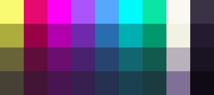

> Synthwave inspired color palette

## Palette

### Base


### Terminal


### Extended


C | HEX | C | HEX | C | HEX | C | HEX
--- | --- | --- | --- | --- | --- | --- | ---
 | `f8f871` |  | `abab3c` |  | `676336` |  | `453f33`
 | `e80b72` |  | `9b0048` |  | `5f0d3c` |  | `411436`
 | `ff00f6` |  | `b200ac` |  | `6b0d6e` |  | `47144f`
 | `aa53f8` |  | `6d28ab` |  | `48216d` |  | `361e4e`
 | `55a7fa` |  | `296bad` |  | `26436e` |  | `252f4f`
 | `00fbfd` |  | `00afb0` |  | `126570` |  | `1b4050`
 | `0be6a6` |  | `00996c` |  | `125a4e` |  | `1b3a3f`
 | `f8f8f1` |  | `f2f2e3` |  | `b8b1bb` |  | `7f7094`
 | `393144` |  | `241b30` |  | `191221` |  | `0e0a13`


## Implementations

### Terminal


## Fish

```sh
# https://fishshell.com/docs/current/cmds/set_color.html#cmd-set-color

set -U fish_color_normal WHITE # default color
set -U fish_color_command BRMAGENTA # commands like echo
set -U fish_color_keyword BRMAGENTA # keywords like if - this falls back on the command color if unset
set -U fish_color_quote BRCYAN # quoted text like "abc"
set -U fish_color_redirection BRYELLOW # IO redirections like >/dev/null
set -U fish_color_end BRYELLOW # process separators like ';' and '&'
set -U fish_color_error WHITE # syntax errors
set -U fish_color_param BRWHITE # ordinary command parameters
set -U fish_color_comment BRBLACK # comments like '# important'
set -U fish_color_selection normal # selected text in vi visual mode
set -U fish_color_operator BRYELLOW # parameter expansion operators like '*' and '~'
set -U fish_color_escape CYAN # character escapes like 'n' and 'x70'
set -U fish_color_autosuggestion BRBLACK # autosuggestions (the proposed rest of a command)
set -U fish_color_cwd normal # the current working directory in the default prompt
set -U fish_color_user normal # the username in the default prompt
set -U fish_color_host normal # the hostname in the default prompt
set -U fish_color_host_remote normal # the hostname in the default prompt for remote sessions (like ssh)
set -U fish_color_cancel normal # the '^C' indicator on a canceled command
set -U fish_color_search_match normal # history search matches and selected pager items (background only)
set -U fish_pager_color_progress normal # the progress bar at the bottom left corner
set -U fish_pager_color_background --background=normal # the background color of a line
set -U fish_pager_color_prefix WHITE --underline # the prefix string, i.e. the string that is to be completed
set -U fish_pager_color_completion BRBLACK # the completion itself, i.e. the proposed rest of the string
set -U fish_pager_color_description BRBLACK # the completion description
set -U fish_pager_color_selected_background --background=normal # background of the selected completion
set -U fish_pager_color_selected_prefix BRGREEN --bold --underline # prefix of the selected completion
set -U fish_pager_color_selected_completion BRGREEN # suffix of the selected completion
set -U fish_pager_color_selected_description BRWHITE # description of the selected completion
set -U fish_pager_color_secondary_background normal # background of every second unselected completion
set -U fish_pager_color_secondary_prefix WHITE --underline # prefix of every second unselected completion
set -U fish_pager_color_secondary_completion BRBLACK # suffix of every second unselected completion
set -U fish_pager_color_secondary_description BRBLACK # description of every second unselected completion

```

## FZF

```sh
export FZF_DEFAULT_OPTS='
--color=fg:#b8b1bb,bg:-1,hl:#7f7094
--color=fg+:#0be6a6,bg+:#241b30,hl+:#00996c
--color=info:#aa53f8,prompt:#0be6a6,pointer:#241b30
--color=marker:#0be6a6,spinner:#aa53f8,header:#f8f871
'

```

## Starship
Using a [Nerd Font](https://www.nerdfonts.com/)


```toml
[character]
success_symbol = "[❯](bold 0be6a6)"
error_symbol = "[❯](bold e80b72)"

[cmd_duration]
format = "[took $duration](#7f7094) "

[directory]
read_only = " "
style = "#00fbfd bold"

[git_branch]
format = "[on](#7f7094) [ $branch](#ff00f6) "

[package]
style = ""
format = "[is](#7f7094) [$version](#f2f2e3) "

[nodejs]
format = "[<node $version>](#f8f871) "

```

## VCS / Diff

Status | C | Hex
--- | --- | ---
Added gutter |  | #125a4e
Added background |  | #1b3a3f
Deleted gutter |  | #5f0d3c
Deleted background |  | #411436
Modified gutter |  | #26436e
Modified background |  | #252f4f
Conflict gutter |  | #676336
Conflict background |  | #453f33

